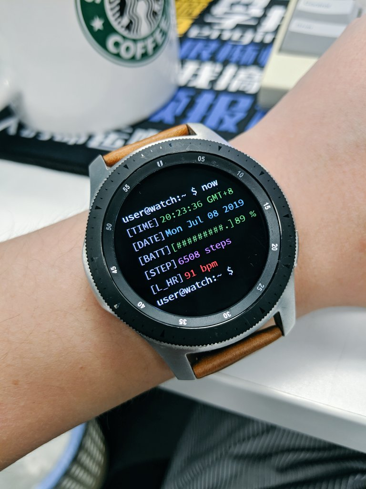
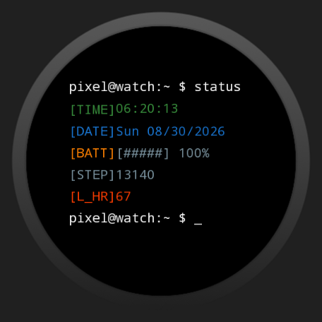
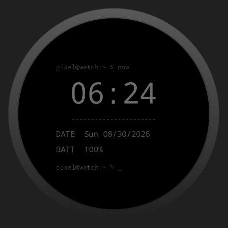

# Linux Terminal Watch Face

A Linux terminal-inspired watch face for Wear OS. Version 2 is rebuilt with
[Watch Face Format 2](https://developer.android.com/training/wearables/wff),
with no executable code or background service.

It is designed for the original Pixel Watch on Wear OS 5/5.1 and scales to
other round Wear OS devices running API 34 or newer.

## Inspiration

The design is based on this original Linux terminal watch-face concept:



## Preview

| Interactive mode | Always-on display |
|---|---|
|  |  |

## Features

- Device-local 12/24-hour time with seconds in interactive mode
- OLED-friendly ambient mode without seconds
- Date and live watch battery percentage, including a low-battery warning
- Real step-count and heart-rate complications instead of hard-coded values
- Three user-selectable terminal color palettes
- Editable complication providers in the watch-face editor

Heart-rate availability depends on the provider installed on the watch and its
permissions. Open the watch-face editor to select a different provider if the
default system provider does not show data.

## Install on a Pixel Watch

1. Download `linux-watch-face-signed` from the latest successful **Build APK**
   workflow run and extract `app-release.apk`.
2. Enable **Developer options** and **ADB debugging** on the watch.
3. Connect ADB over Wi-Fi and install the APK:

   ```shell
   adb connect WATCH_IP_ADDRESS:PORT
   adb install -r app-release.apk
   ```

4. Open the watch-face picker on the watch and select **Linux Terminal**.

The workflow runs for every branch push and pull request. APK artifacts from
branch pushes and tagged GitHub releases use the same persistent signing key,
so they can update an existing CI installation with `adb install -r`. Pull
requests are compiled for validation but don't receive access to signing
secrets.

## Build locally

Install JDK 17 and Android SDK Platform 35, then run:

```shell
./gradlew assembleDebug
```

On Windows:

```powershell
.\gradlew.bat assembleDebug
```

The APK is written to `app/build/outputs/apk/debug/app-debug.apk`.

To build an APK with the same persistent key as CI, configure
`~/.gradle/linux-watch-face-signing.properties` and run:

```powershell
.\gradlew.bat assembleRelease
```

The signed output is `app/build/outputs/apk/release/app-release.apk`.

## Configure signed releases

Create a release keystore once and add these GitHub Actions repository secrets:

| Secret | Value |
|---|---|
| `ANDROID_KEYSTORE_BASE64` | Base64-encoded keystore file |
| `ANDROID_KEYSTORE_PASSWORD` | Keystore password |
| `ANDROID_KEY_ALIAS` | Signing-key alias |
| `ANDROID_KEY_PASSWORD` | Signing-key password |

On PowerShell, encode the keystore with:

```powershell
[Convert]::ToBase64String([IO.File]::ReadAllBytes("release.jks")) |
    Set-Content -NoNewline keystore-base64.txt
```

Push a semantic version tag to build a signed APK and AAB and attach both to a
GitHub release:

```shell
git tag v2.0.0
git push origin v2.0.0
```

Use the APK for direct installation. The AAB is the artifact to upload to a
Google Play Console internal testing or production track. Before publishing,
replace the legacy launcher and preview artwork with final store assets, create
the Wear OS store listing, and enroll the app in Play App Signing.
